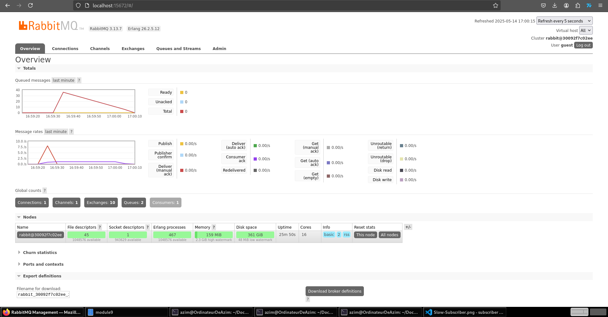
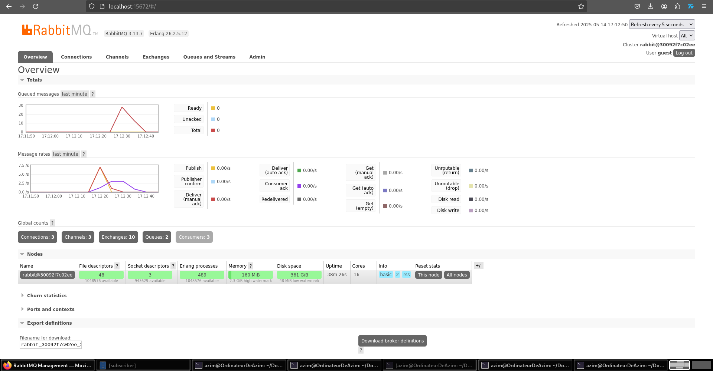

# Reflection

## Part 1.

### a. What is AMQP?

**AMQP** (Advanced Message Queuing Protocol) is a standardized messaging protocol that enables systems to communicate with each other via message queues in a reliable, asynchronous, and decoupled manner.

It is often used in message brokers like RabbitMQ to support **publish/subscribe** and **message queuing** patterns. AMQP defines how messages are formatted, sent, routed, and received between systems.

---

### b. What does it mean? guest:guest@localhost:5672, what is the first guest, and what is the second guest, and what is localhost:5672 is for?

This is a connection URI used to connect to the RabbitMQ server using AMQP protocol:

- **First `guest`**: This is the **username** used to log into RabbitMQ.
- **Second `guest`**: This is the **password** for that username.
- **`localhost`**: This means the RabbitMQ server is running on the **local machine**.
- **`5672`**: This is the **default AMQP port** used by RabbitMQ to listen for incoming client connections.

## Part 2.

On my machine, the queue reached a total of **35 messages**.

This happened because I ran the publisher multiple times quickly, sending events faster than the subscriber could consume. Since each run of the publisher sends 5 messages, and I ran it 8 times rapidly, the subscriber received and proceed them and the queue had `5 × (8-1) = 35` messages.

As seen in the screenshot, the **queue spike is reduced faster than before**, because multiple subscribers are now consuming messages **simultaneously**.

Instead of a single slow subscriber processing one event per second, three subscribers now pull from the same queue.  
This enables **parallel event processing**, which helps reduce the message backlog more quickly.

For example, one console handled:
- “Budi” and “Dira”

While another processed:
- “Amir”, “Cica”, and “Emir”

This confirms that RabbitMQ supports **multiple consumers per queue** effectively.

On the Publisher side, we could improve the publisher by adding a **delay between sends**. On the Subscriber side, we could add log **thread IDs** or **subscriber instance IDs** to trace parallelism and to know precisely where was each event received.
